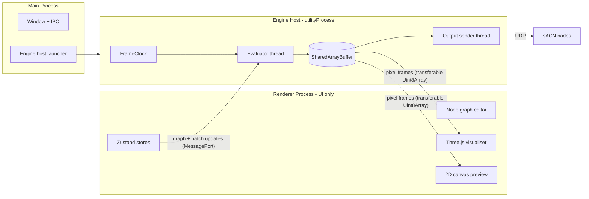

# PixelForge — Cursor Development Plan

> **Historical roadmap.** This document guided early development. Checkboxes and the planned tree may lag the shipped codebase — prefer [README.md](README.md) and `src/` for current architecture.

> Node-based LED sequencer with sACN output, 3D visualisation, and live effect authoring.

---

## Tech Stack

| Layer | Technology | Rationale |
|---|---|---|
| App shell | Electron | Packaging, offline installs, cross-platform |
| UI framework | React 19 + TypeScript | Component model, ecosystem, team familiarity |
| Node graph UI | @xyflow/react | Production-ready graph canvas, actively maintained |
| 3D visualiser | Three.js | STL loading, InstancedMesh for pixels |
| Effect engine | Electron `utilityProcess` + worker_threads | Real-time pipeline isolated from renderer; SharedArrayBuffer works within one OS process |
| sACN output | Node.js `sacn` package (worker_thread in engine host) | Proven, handles multicast/unicast |
| State management | Zustand | Lightweight, works well with graph state |
| Serialisation | JSON with versioned schema | Human-readable save files, migratable |
| Build tooling | Vite + electron-vite | Fast HMR, good Electron integration |

**Future escape hatch:** The engine host runs behind a clean MessagePort interface. The evaluator and output sender can be replaced with a Rust sidecar later without touching the UI.

---

## Process Model

Electron's main and renderer are separate OS processes — SharedArrayBuffer cannot be shared across them. The entire real-time pipeline therefore lives in a dedicated **engine host** (`utilityProcess`), not in the renderer.



**Why this layout:**

- SharedArrayBuffer sharing actually works between evaluator and output sender (same OS process).
- Frame copies to the renderer are cheap (~1.3 MB/s at 10k pixels × 44 fps) and only feed previews; the visualiser tolerates one-frame latency.
- A renderer hang or crash never stops DMX output.
- **Headless mode** is free: launch the engine host with a project file path and no window.
- Node graph code is shared TypeScript, imported by both the renderer (editing) and the engine host (evaluation).

---

## Repository Structure

```
pixelforge/
├── src/
│   ├── main/                        # Electron main process
│   │   ├── index.ts                 # App entry, window management
│   │   ├── engine/
│   │   │   └── EngineLauncher.ts    # Spawns engine host utilityProcess
│   │   └── ipc/
│   │       ├── project.ts           # Save/load/export
│   │       └── network.ts           # Network interface enumeration
│   │
│   ├── engine-host/                 # utilityProcess — real-time pipeline
│   │   ├── index.ts                 # MessagePort entry, lifecycle
│   │   ├── FrameClock.ts            # Timing, BPM, drift correction
│   │   ├── evaluator/
│   │   │   ├── Evaluator.ts         # Pull-based graph evaluation
│   │   │   ├── BufferPool.ts        # Pooled typed-array pixel buffers
│   │   │   ├── GraphCache.ts        # Cycle detection, adjacency cache
│   │   │   └── blend.ts             # Oklab blending on typed arrays
│   │   └── output/
│   │       ├── OutputSender.ts      # Output sender thread coordinator
│   │       ├── output.worker.ts     # Packs DMX frames, sends UDP
│   │       ├── OutputProtocol.ts    # Protocol interface (sACN, Art-Net)
│   │       └── SacnProtocol.ts      # sACN implementation
│   │
│   ├── shared/                      # Code used by renderer and engine host
│   │   ├── graph/
│   │   │   ├── types.ts             # Port types, node interfaces
│   │   │   ├── registry.ts          # Node type registry
│   │   │   └── nodes/               # Node evaluate implementations
│   │   │       ├── generators/
│   │   │       │   ├── SolidColour.ts
│   │   │       │   ├── Gradient.ts
│   │   │       │   ├── Noise.ts
│   │   │       │   ├── Wave.ts
│   │   │       │   └── Strobe.ts
│   │   │       ├── transforms/
│   │   │       │   ├── Remap.ts
│   │   │       │   ├── Mirror.ts
│   │   │       │   └── Offset.ts
│   │   │       ├── compositing/
│   │   │       │   ├── Mix.ts
│   │   │       │   ├── Add.ts
│   │   │       │   └── Multiply.ts
│   │   │       ├── colour/
│   │   │       │   ├── HsvShift.ts
│   │   │       │   ├── Curves.ts
│   │   │       │   └── PaletteMap.ts
│   │   │       ├── time/
│   │   │       │   ├── Lfo.ts
│   │   │       │   ├── BpmClock.ts
│   │   │       │   ├── Delay.ts
│   │   │       │   └── Trigger.ts
│   │   │       ├── sequencing/
│   │   │       │   ├── SequenceNode.ts
│   │   │       │   └── Transition.ts
│   │   │       ├── pixelspace/
│   │   │       │   ├── UvProject.ts
│   │   │       │   └── DistanceField.ts
│   │   │       └── output/
│   │   │           ├── PixelOutput.ts
│   │   │           └── Preview.ts
│   │   ├── patch/
│   │   │   ├── types.ts             # Pixel, PatchData, UniverseMap
│   │   │   ├── autoPatch.ts         # Sequential universe assignment
│   │   │   └── validate.ts          # Overlap/gap/boundary checks
│   │   └── colour/
│   │       └── oklab.ts             # Hand-rolled sRGB ↔ Oklab on typed arrays
│   │
│   ├── renderer/                    # React app — UI only, no evaluation
│   │   ├── index.tsx
│   │   ├── App.tsx
│   │   │
│   │   ├── store/
│   │   │   ├── graphStore.ts
│   │   │   ├── patchStore.ts
│   │   │   ├── engineStore.ts       # Playback state, clock (mirrors engine host)
│   │   │   └── projectStore.ts
│   │   │
│   │   ├── graph/
│   │   │   ├── NodeGraph.tsx        # @xyflow/react canvas wrapper
│   │   │   └── components/          # Custom node UIs
│   │   │       ├── BaseNode.tsx
│   │   │       ├── SequenceNodeUI.tsx
│   │   │       └── PreviewNodeUI.tsx
│   │   │
│   │   ├── preview/
│   │   │   └── CanvasPreview.tsx    # 2D pixel preview (Milestone 1)
│   │   │
│   │   ├── visualiser/
│   │   │   ├── Visualiser.tsx
│   │   │   ├── StlLoader.ts
│   │   │   ├── PixelPoints.ts
│   │   │   └── CameraControls.ts
│   │   │
│   │   ├── patch/
│   │   │   ├── PatchEditor.tsx
│   │   │   └── PointImporter.ts
│   │   │
│   │   └── ui/
│   │       ├── Layout.tsx
│   │       ├── Toolbar.tsx
│   │       ├── Inspector.tsx
│   │       ├── NetworkPanel.tsx
│   │       └── StatusBar.tsx
│   │
└── package.json
```

---

## Data Model

### Project File (`.pxf` — JSON)

```typescript
interface ProjectFile {
  version: string                    // schema version, increment on breaking changes
  meta: {
    name: string
    created: string
    modified: string
  }
  patch: PatchData
  graph: GraphData
  settings: AppSettings
}
```

### Patch

```typescript
interface PatchData {
  pixels: Pixel[]
}

interface Pixel {
  id: string
  label?: string
  position: { x: number; y: number; z: number }  // world space, metres
  universe: number                                 // 1-based sACN universe
  channel: number                                  // 1-based DMX channel (RGB = 3 channels)
  channelCount: 3 | 4                              // RGB or RGBW
}
```

**Patching rules:**

- DMX512 allows 512 channels per universe. For RGB pixels that is **170 pixels per universe** (510 channels); 2 channels remain unused.
- Auto-patch assigns pixels sequentially in import order. When the next pixel would exceed the universe channel budget, it wraps to universe N+1 at channel 1.
- **No pixel may straddle a universe boundary** — a 3-channel pixel must fit entirely within one universe. Validation flags any assignment that would cross the boundary.
- RGBW pixels (4 channels) allow 128 pixels per universe (512 channels exactly).

### Graph

```typescript
interface GraphData {
  nodes: NodeData[]
  edges: EdgeData[]
}

interface NodeData {
  id: string
  type: string                       // matches registry key
  position: { x: number; y: number } // canvas position
  params: Record<string, ParamValue> // user-set parameter values
  label?: string                     // optional user rename
}

interface EdgeData {
  id: string
  fromNode: string
  fromPort: string
  toNode: string
  toPort: string
}
```

### Node Type Definition

```typescript
interface NodeTypeDef {
  type: string                       // unique key e.g. 'generator/gradient'
  label: string
  category: 'generator' | 'transform' | 'composite' | 'colour' | 'time' | 'sequence' | 'output'
  inputs: PortDef[]
  outputs: PortDef[]
  params: ParamDef[]
  evaluate: (inputs: PortValues, params: ParamValues, ctx: EvalContext) => PortValues
}

interface PortDef {
  name: string
  type: 'float' | 'vec2' | 'vec3' | 'colour' | 'pixels' | 'trigger' | 'string'
  default?: unknown
  optional?: boolean
}

interface ParamDef {
  name: string
  type: 'float' | 'int' | 'boolean' | 'colour' | 'select' | 'string'
  default: unknown
  min?: number
  max?: number
  options?: string[]                 // for select type
}
```

### Sequence Node (Internal State)

Segments connect via **input ports**, not hidden node references. Each segment has a dedicated input port on the sequence node; users wire the effect graph into that port with a visible edge.

```typescript
interface SequenceSegment {
  id: string
  inputPort: string                  // port name on this sequence node, e.g. 'segment_0'
  duration: number                   // in beats
  transition: {
    type: 'cut' | 'crossfade' | 'dissolve' | 'wipe'
    duration: number                 // in beats
    curve: 'linear' | 'ease-in' | 'ease-out' | 'ease-in-out'
    blendInputPort?: string          // optional custom blend wired via input port
  }
}
```

The sequence node's port list is dynamic: adding a segment adds an input port. All dependencies are visible in the graph.

---

## Engine Architecture

### Frame Loop

```
FrameClock (engine host main thread)
  │  fires every ~22ms (target 44fps)
  │
  ▼
Evaluator (worker_thread in engine host)
  │  1. pull-evaluate from output node(s) with per-frame memoisation
  │  2. only active nodes evaluate (sequence transitions pull two branches)
  │  3. write RGB values into SharedArrayBuffer via pooled buffers
  │  4. post transferable Uint8Array copy to renderer MessagePort
  │
  ▼
OutputSender (worker_thread in engine host)
  │  reads SharedArrayBuffer
  │  packs DMX512 frames per universe via OutputProtocol
  │  sends UDP packets
  │  resends last frame on own tick (sACN keepalive)
  │
  ▼
Network → sACN nodes/controllers
```

The output sender runs its **own tick** independent of the evaluator. A slow evaluation frame must never delay a DMX packet.

### SharedArrayBuffer Pixel Layout

```
Offset 0: pixel 0 R
Offset 1: pixel 0 G
Offset 2: pixel 0 B
Offset 3: pixel 1 R
...
```

Only the evaluator and output sender share this buffer (same OS process). The renderer receives a **transferable copy** each frame for preview and visualisation.

### Pull-Based Evaluation

Evaluation starts from output node(s) and walks upstream on demand:

1. Output node requests its inputs; each input triggers upstream `evaluate()` if not already memoised this frame.
2. Per-frame memoisation map keyed by `nodeId` — a node evaluates at most once per frame.
3. Only nodes on the active path evaluate. Inactive sequence segments are never pulled.
4. Graph adjacency and cycle detection are cached; recomputed only when nodes or edges change.
5. Pixel-array ports use **pooled `Float32Array` buffers** from `BufferPool` — nodes write into pre-allocated buffers, never allocate fresh arrays per frame.

### Evaluation Context

Passed to every node's evaluate function each frame:

```typescript
interface EvalContext {
  time: number          // wall clock ms
  beat: number          // fractional beat position
  bpm: number
  deltaTime: number     // ms since last frame
  samplePixel: (uv: Vec2) => Colour   // sample effect at UV coordinate
  pixels: Pixel[]       // full patch for spatial queries
  bufferPool: BufferPool
}
```

### Output Protocol Abstraction

```typescript
interface OutputProtocol {
  name: string
  send(universes: Map<number, Uint8Array>): void
  setInterface(iface: string): void
  close(): void
}
```

`sACN` is the first implementation (`SacnProtocol`). Art-Net is a later drop-in implementing the same interface — no evaluator changes required.

### RGBW Handling

The internal pipeline stays **RGB float** throughout. White is derived at the `PixelOutput` node per pixel:

- `channelCount: 3` — write R, G, B directly.
- `channelCount: 4` — derive W using a configurable strategy (e.g. `W = min(R, G, B)` subtractive, or `W = luminance` additive). Strategy is a per-project setting, not a graph node concern.

This avoids a 4-channel colour type through every node.

### Headless Mode

The engine host accepts a project file path as a CLI argument and runs without a renderer window. Main process can launch it directly for rack installs:

```
PixelForge Player --headless --project /path/to/show.pxf --interface en0 --auto-output
PixelForge Player --headless --show-dir /path/to/show-folder --auto-output
```

### Startup Show

Player can load a specific show automatically on launch and register **Launch at login** (macOS/Windows) so rack PCs reboot into a running show without bash scripts.

- **Startup Show** panel in Player: pick `.pxf` or exported show folder, pin network interface, auto-start output, choose windowed vs headless, enable launch at login.
- Settings persist in `player-startup.json` under user data; login item args mirror CLI flags.
- Exported `show.json` can include optional `startup` hints (interface, autoOutput, headless) prefilled when selecting a show folder on site.
- CLI: `--project`, `--show-dir`, `--auto-output`, `--interface`, `--headless`.

---

## Sequence Node — Detailed Behaviour

The sequence node is the primary way users arrange looks over time.

**Inputs:**
- `segment_0`, `segment_1`, … `segment_N` (pixels) — one per segment, wired from effect subgraphs
- `clock` (trigger) — advance to next segment
- `reset` (trigger) — return to segment 1
- `intensity` (float 0–1) — master opacity

**Outputs:**
- `pixels` — blended pixel array

**Evaluation logic:**
1. Check current beat position against segment durations.
2. Determine active segment(s). If in transition window, pull-evaluate both outgoing and incoming segment inputs.
3. Blend pixel arrays in Oklab colour space (hand-rolled on typed arrays) using transition curve.
4. Apply intensity.
5. Return blended buffer from pool.

**Nesting:** A segment input can be wired from another sequence node's output. Pull-based evaluation handles nesting naturally; cycle detection prevents infinite loops.

---

## Milestones

### Milestone 1 — Foundation
**Goal:** sACN output working end-to-end from a hardcoded colour value.

- [ ] Electron + Vite + React 19 + TypeScript scaffold
- [ ] Main/renderer IPC bridge
- [ ] Engine host `utilityProcess` with MessagePort to renderer
- [ ] Output sender thread — send a solid colour to a universe via `SacnProtocol`
- [ ] Network interface selector UI
- [ ] SharedArrayBuffer pixel buffer between evaluator and output sender
- [ ] FrameClock with drift correction
- [ ] 2D canvas preview — render pixel buffer as a colour grid (debug before 3D visualiser)
- [ ] Basic status bar (FPS, universe count, output on/off)

**Exit criteria:** A real sACN node lights up from the app; 2D preview shows the output colour.

---

### Milestone 2 — Patch System
**Goal:** Import real pixel data and map it to universes.

- [ ] CSV/JSON point cloud importer (x, y, z, universe, channel)
- [ ] Patch editor UI — table view of pixels, editable universe/channel
- [ ] Auto-patch tool — sequential assignment with universe wrap at 170 RGB / 128 RGBW pixels
- [ ] Patch validation — overlapping channels, gaps, universe boundary violations
- [ ] Export patch as CSV

**Exit criteria:** Import a real installation's point data and verify sACN channels match.

---

### Milestone 3 — Node Graph Core
**Goal:** Working node graph that drives pixel output.

- [ ] @xyflow/react canvas with custom styling
- [ ] Node type registry (shared between renderer and engine host)
- [ ] Port type system with connection validation (type checking)
- [ ] Pull-based evaluator with per-frame memoisation and buffer pooling
- [ ] Cycle detection (cached adjacency, recomputed on graph change)
- [ ] Inspector panel — edit node params on selection
- [ ] Undo/redo (Zustand snapshot history)
- [ ] First generator nodes: SolidColour, Gradient, Noise, Wave
- [ ] First output node: PixelOutput (writes to SharedArrayBuffer, handles RGBW)
- [ ] Graph serialisation/deserialisation

**Exit criteria:** Build a graph that drives real pixels via sACN.

---

### Milestone 4 — 3D Visualiser
**Goal:** See the output on the model in real time.

- [x] Three.js canvas component
- [x] STL mesh loader
- [x] InstancedMesh pixel points — one sphere per pixel
- [x] Receive transferable pixel frame each tick, colour instances
- [x] Orbit controls, zoom, pan
- [x] Toggle mesh visibility, pixel size control
- [x] Top/front/side preset camera views

**Exit criteria:** Load a client's STL, import their point cloud, see live output on the model.

---

### Milestone 5 — Sequence Node
**Goal:** Arrange effects into timed sequences with transitions.

- [ ] SequenceNode with dynamic segment input ports
- [ ] Segment list UI inside node (inline editor, add/remove segments)
- [ ] Cut and crossfade transitions
- [ ] Oklab blending for transitions (typed-array implementation)
- [ ] BPM clock node
- [ ] Beat-snapping for segment durations
- [ ] Trigger input (keyboard; MIDI deferred)
- [ ] Intensity input
- [ ] Nested sequences via port wiring

**Exit criteria:** Build a 4-segment sequence with crossfades that runs to BPM clock and advances on keypress.

---

### Milestone 6 — Node Library
**Goal:** Enough nodes for real show programming.

**Generators:** Strobe, Video playback (file), Image, Audio FFT reactive

**Transforms:** Mirror, Offset, Scale, Rotate (UV space), Mask

**Compositing:** Add, Multiply, Screen, Over, Mix (with blend mode select)

**Colour:** HSV Shift, Levels, Curves, Palette Map, Colour Correct

**Time:** LFO (sine/square/saw/triangle), Delay, Hold, Ramp

**Pixel space:** Cylindrical project, Spherical project, Distance field

**Logic:** Compare, Switch, Gate

**Exit criteria:** Recreate a typical TD patch using only built-in nodes.

---

### Milestone 7 — Polish + Distribution
**Goal:** Shippable to early customers.

- [x] Licensing system — removed; PixelForge is fully open source under AGPL-3.0
- [x] PixelForge Player — separate installer, minimal UI, headless CLI
- [x] Auto-updater (electron-updater)
- [x] Crash reporting (Sentry — opt-in via `PIXELFORGE_SENTRY_DSN`)
- [x] Mac + Windows installers (electron-builder: `npm run dist:editor` / `dist:player`)
- [x] Headless mode CLI (`--headless`, `--project`, `--interface`) on Player
- [x] Startup Show — launch at login, auto-load show, CLI `--show-dir` / `--auto-output`
- [x] Onboarding — first-run dialog + example patches
- [ ] Keyboard shortcuts (documented, reassignable) — partial: undo/redo/sequence keys; Help doc deferred
- [x] Performance profiler — per-node frame time display
- [x] Output diagnostics panel — per-universe packet rate, error counts
- [x] Art-Net output via `OutputProtocol` interface
- [x] Project file migration system (1.0 → 1.3 incremental chain)
- [x] Export show bundle for Player deployment

**Exit criteria:** Installable Editor + Player; Player runs shows without activation gates; headless rack mode works.

---

## Key Technical Rules (for Cursor)

1. **Never evaluate the graph in the renderer process.** All graph evaluation happens in the engine host evaluator thread. The renderer only edits the graph and displays preview frames.

2. **SharedArrayBuffer is engine-host only.** The evaluator and output sender share the buffer within the engine host process. The renderer receives a transferable `Uint8Array` copy per frame — never attempt cross-process SharedArrayBuffer.

3. **Pull-based evaluation with per-frame memoisation.** Do not topologically walk and evaluate every node each frame. Start from output nodes; only pull upstream nodes that are needed. Memoise results per frame.

4. **Buffer pooling for pixel arrays.** Nodes write into pooled `Float32Array` buffers from `BufferPool`. Never allocate fresh pixel arrays inside `evaluate()`.

5. **Typed ports enforced at connection time.** @xyflow/react `isValidConnection` callback must check port type compatibility before allowing an edge.

6. **Graph adjacency cached for cycle detection only.** Recompute when nodes or edges change. Do not re-sort or re-walk every frame.

7. **Oklab for all colour blending.** Use hand-rolled sRGB ↔ Oklab conversions on typed arrays (`shared/colour/oklab.ts`). Never lerp in RGB. Use `culori` only in UI colour pickers, never in the per-pixel evaluation path.

8. **Project file is versioned from day one.** Every save writes `version: "1.0.0"`. Every load checks version and runs migrations if needed.

9. **Undo/redo covers graph edits only.** Use Zustand's state snapshots. Limit history to 50 snapshots.

10. **InstancedMesh only for pixel visualisation.** Never create individual Three.js objects per pixel.

11. **Output sender is independent of evaluation.** The output sender runs its own tick and resends the last frame for sACN keepalive. A slow evaluation frame must never delay a DMX packet.

12. **No `any` in TypeScript.** Strict mode on. Port values and node params must be fully typed.

13. **Sequence segments use input ports, not node references.** Every segment dependency must be a visible edge in the graph.

14. **OutputProtocol abstraction from day one.** sACN is the first implementation; Art-Net plugs in later without evaluator changes.

---

## Dependencies

```json
{
  "dependencies": {
    "react": "^19",
    "react-dom": "^19",
    "@xyflow/react": "^12",
    "three": "^0.170",
    "zustand": "^5",
    "sacn": "^3",
    "culori": "^4"
  },
  "devDependencies": {
    "electron": "^34",
    "electron-vite": "latest",
    "vite": "^6",
    "typescript": "^5",
    "@types/three": "latest",
    "@types/react": "latest"
  }
}
```

Note: `electron` is a devDependency — electron-builder and electron-vite expect it there. `culori` is for UI colour pickers only; the evaluation path uses `shared/colour/oklab.ts`.

---

## Open Questions (Decide Before Milestone 5)

1. **MIDI input** — which library (`easymidi`, `webmidi`)? Expose as trigger nodes and/or clock sync?
2. **Ableton Link** — high value for live events. `abletonlink` npm package exists but needs testing on both platforms.
3. **Plugin API** — user-authored nodes. Define the `NodeTypeDef` export interface now even if the feature ships in Milestone 7.

**Decided (no longer open):**

- **RGBW:** Internal pipeline stays RGB float; W derived at `PixelOutput` per pixel `channelCount`. See [RGBW Handling](#rgbw-handling).
- **Art-Net:** `OutputProtocol` interface from day one; sACN first, Art-Net in Milestone 7. See [Output Protocol Abstraction](#output-protocol-abstraction).
- **Headless mode:** Engine host runs standalone with `--headless` CLI flag. See [Headless Mode](#headless-mode).
